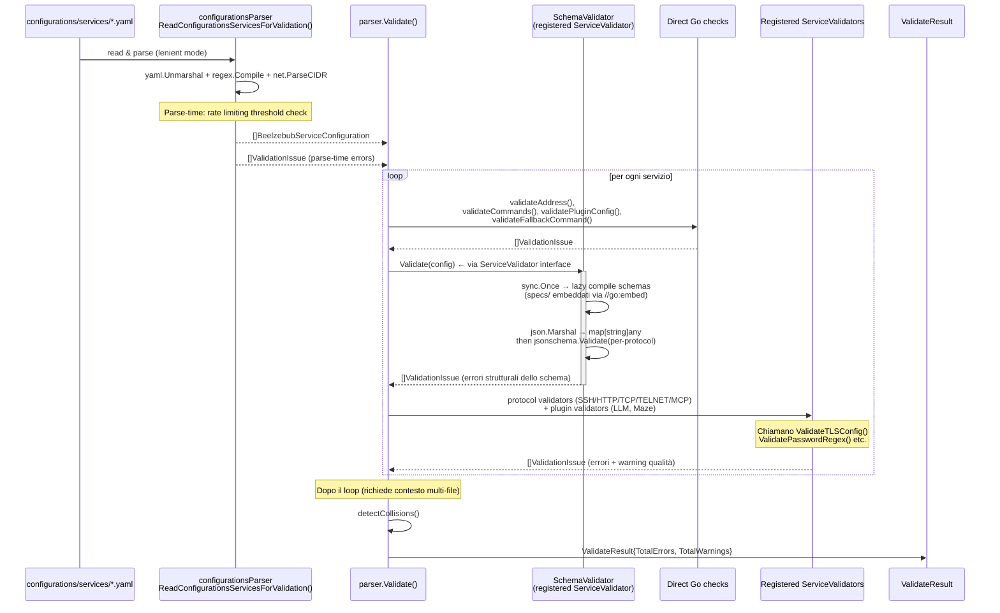

# Contributing to Beelzebub

First off, thanks for taking the time to contribute! ❤️

All types of contributions are encouraged and valued. See the [Table of Contents](#table-of-contents) for different ways to help and details about how this project handles them. Please make sure to read the relevant section before making your contribution. It will make it a lot easier for us maintainers and smooth out the experience for all involved. The community looks forward to your contributions. 🎉

> And if you like the project, but just don't have time to contribute, that's fine. There are other easy ways to support the project and show your appreciation, which we would also be very happy about:
> - Star the project
> - Tweet about it
> - Refer this project in your project's readme
> - Mention the project at local meetups and tell your friends/colleagues

## Table of Contents

- [Code of Conduct](#code-of-conduct)
- [I Have a Question](#i-have-a-question)
- [I Want To Contribute](#i-want-to-contribute)
    - [Reporting Bugs](#reporting-bugs)
    - [Suggesting Enhancements](#suggesting-enhancements)
## Code of Conduct

This project and everyone participating in it is governed by the
[Beelzebub Code of Conduct](https://github.com/beelzebub-labs/beelzebub/blob/main/CODE_OF_CONDUCT.md).
By participating, you are expected to uphold this code. Please report unacceptable behavior
to <mario.candela.personal@gmail.com>.


## I Have a Question

> If you want to ask a question, we assume that you have read the available [Documentation](https://beelzebub-honeypot.com/docs/).

Before you ask a question, it is best to search for existing [Issues](https://github.com/beelzebub-labs/beelzebub/issues) that might help you. In case you have found a suitable issue and still need clarification, you can write your question in this issue. It is also advisable to search the internet for answers first.

If you then still feel the need to ask a question and need clarification, we recommend the following:

- Open an [Issue](https://github.com/beelzebub-labs/beelzebub/issues/new).
- Provide as much context as you can about what you're running into.
- Provide project and platform versions (docker, beelzebub, etc), depending on what seems relevant.

We will then take care of the issue as soon as possible.

## I Want To Contribute

> ### Legal Notice <!-- omit in toc -->
> When contributing to this project, you must agree that you have authored 100% of the content, that you have the necessary rights to the content and that the content you contribute may be provided under the project license.

### Reporting Bugs

#### Before Submitting a Bug Report

A good bug report shouldn't leave others needing to chase you up for more information. Therefore, we ask you to investigate carefully, collect information and describe the issue in detail in your report. Please complete the following steps in advance to help us fix any potential bug as fast as possible.

- Make sure that you are using the latest version.
- Determine if your bug is really a bug and not an error on your side e.g. using incompatible environment components/versions (Make sure that you have read the [documentation](https://beelzebub-honeypot.com/docs/). If you are looking for support, you might want to check [this section](#i-have-a-question)).
- To see if other users have experienced (and potentially already solved) the same issue you are having, check if there is not already a bug report existing for your bug or error in the [bug tracker](https://github.com/beelzebub-labs/beelzebubissues?q=label%3Abug).
- Also make sure to search the internet (including Stack Overflow) to see if users outside of the GitHub community have discussed the issue.
- Collect information about the bug:
    - Stack trace (Traceback)
    - OS, Platform and Version (Windows, Linux, macOS, x86, ARM)
    - Version of the interpreter, compiler, SDK, runtime environment, package manager, depending on what seems relevant.
    - Possibly your input and the output
    - Can you reliably reproduce the issue? And can you also reproduce it with older versions?

#### How Do I Submit a Good Bug Report?

> You must never report security related issues, vulnerabilities or bugs including sensitive information to the issue tracker, or elsewhere in public. Instead sensitive bugs must be sent by email to <mario.candela.personal@gmail.com>.

We use GitHub issues to track bugs and errors. If you run into an issue with the project:

- Open an [Issue](https://github.com/beelzebub-labs/beelzebub/issues/new). (Since we can't be sure at this point whether it is a bug or not, we ask you not to talk about a bug yet and not to label the issue.)
- Explain the behavior you would expect and the actual behavior.
- Please provide as much context as possible and describe the *reproduction steps* that someone else can follow to recreate the issue on their own. This usually includes your code. For good bug reports you should isolate the problem and create a reduced test case.
- Provide the information you collected in the previous section.

Once it's filed:

- The project team will label the issue accordingly.
- A team member will try to reproduce the issue with your provided steps. If there are no reproduction steps or no obvious way to reproduce the issue, the team will ask you for those steps and mark the issue as `needs-repro`. Bugs with the `needs-repro` tag will not be addressed until they are reproduced.

<!-- You might want to create an issue template for bugs and errors that can be used as a guide and that defines the structure of the information to be included. If you do so, reference it here in the description. -->


### Suggesting Enhancements

This section guides you through submitting an enhancement suggestion for Beelzebub, **including completely new features and minor improvements to existing functionality**. Following these guidelines will help maintainers and the community to understand your suggestion and find related suggestions.

<!-- omit in toc -->
#### Before Submitting an Enhancement

- Make sure that you are using the latest version.
- Read the [documentation](https://beelzebub-honeypot.com/docs/) carefully and find out if the functionality is already covered, maybe by an individual configuration.
- Perform a [search](https://github.com/beelzebub-labs/beelzebub/issues) to see if the enhancement has already been suggested. If it has, add a comment to the existing issue instead of opening a new one.
- Find out whether your idea fits with the scope and aims of the project. It's up to you to make a strong case to convince the project's developers of the merits of this feature. Keep in mind that we want features that will be useful to the majority of our users and not just a small subset. If you're just targeting a minority of users, consider writing an add-on/plugin library.

#### How Do I Submit a Good Enhancement Suggestion?

Enhancement suggestions are tracked as [GitHub issues](https://github.com/beelzebub-labs/beelzebub/issues).

- Use a **clear and descriptive title** for the issue to identify the suggestion.
- Provide a **step-by-step description of the suggested enhancement** in as many details as possible.
- **Describe the current behavior** and **explain which behavior you expected to see instead** and why. At this point you can also tell which alternatives do not work for you.
- **Explain why this enhancement would be useful** to most Beelzebub users. You may also want to point out the other projects that solved it better and which could serve as inspiration.

## Configuration Validation Schema

Beelzebub uses a dual-layer validation approach for honeypot service configurations:

1. **JSON Schema (draft-07)** — validates structural correctness: required fields, types, string patterns, enum values, object shape. All violations are **hard errors**.
2. **Go procedural** — validates cross-field constraints (TLS pair, regex syntax, CIDR format), file-system existence (TLS cert files), and quality warnings (missing `deadlineTimeoutSeconds`, inline secrets, handler-less commands). Produces both **errors** and **warnings**.

### Validation flow



A standalone CLI for CI runs schema-only validation:

```
go run ./cmd/validate-specs
```

This reads YAML files, parses them, and validates against the per-protocol JSON Schema, skipping Go procedural checks. Useful for non-Go consumers or quick CI checks.

### Specs directory

`specs/` contains the JSON Schema files that define the shared validation contract:

| File | Description |
|---|---|
| `honeypot-config.schema.json` | Base schema with shared fields and `$defs` (Command, Tool, Plugin, ...) |
| `honeypot-ssh.schema.json` | SSH: requires `passwordRegex`, `serverVersion`, `commands` |
| `honeypot-http.schema.json` | HTTP: requires `commands`, disallows `tools` |
| `honeypot-tcp.schema.json` | TCP: disallows `tools` |
| `honeypot-telnet.schema.json` | TELNET: requires `passwordRegex`, `commands` |
| `honeypot-mcp.schema.json` | MCP: requires `tools`, disallows `commands` |

Per-protocol schemas extend the base via `allOf` + `$ref`. Conditional rules use `if/then`:

- **LLMHoneypot**: if any command or fallback uses plugin `LLMHoneypot`, the top-level `plugin` object must have `llmProvider` and `llmModel` with `minLength: 1`
- **MazeHoneypot**: if any command or fallback uses plugin `MazeHoneypot`, `protocol` must be `http`
- **Rate limiting**: if `plugin.rateLimitEnabled` is `true`, then `rateLimitRequests` and `rateLimitWindowSeconds` must be present and ≥ 1

The schemas are embedded in the Go binary via `//go:embed *.schema.json` in `specs/embed.go`.
The `SchemaValidator` that consumes them is registered via `init()` in `internal/parser/schema_validator.go`.

### Makefile targets

```
make validate-specs        # go run ./cmd/validate-specs (solo schema, per CI)
make validate-all          # validate-specs + beelzebub validate (full)
```

### How to add a new field

1. Add or modify the field in the Go struct (`internal/parser/configurations_parser.go`)
2. Add the corresponding property in `specs/honeypot-config.schema.json` (and per-protocol schemas if protocol-specific)
3. Run `make validate-specs` to verify config files pass
4. Run `make validate-all` for full validation + Go procedural checks
5. If the new field needs a quality warning, add a Go procedural check

### How to add a new validator

1. Implement the `ServiceValidator` interface:
   ```go
   type ServiceValidator interface {
       Name() string
       Validate(config BeelzebubServiceConfiguration) []ValidationIssue
   }
   ```
2. Register it via `init()`:
   ```go
   func init() { parser.RegisterServiceValidator(&YourValidator{}) }
   ```
3. Ensure the package is imported with a blank identifier in `cli/validate.go` to trigger the `init()`:
   ```go
   import _ "github.com/beelzebub-labs/beelzebub/v3/internal/protocols/strategies/YOUR_PROTOCOL"
   ```
   See existing imports for SSH, HTTP, TCP, TELNET, MCP validators as examples.
4. If the validator checks structural rules, add corresponding JSON Schema constraints.

### Validation rule reference

| Category | Rule | Layer | Severity |
|---|---|---|---|
| **Protocol** | `protocol` enum {ssh, http, tcp, telnet, mcp} | Schema | Error |
| **Address** | `address` format host:port or Unix path | Schema | Error |
| **Address** | Port range 1–65535 | Go | Warning |
| **Auth** | `passwordRegex` required for SSH | Schema + Go | Error |
| **Auth** | `passwordRegex` required for TELNET | Schema + Go | Error |
| **Auth** | `passwordRegex` regex syntax | Go | Error |
| **Auth** | `serverVersion` required for SSH | Schema | Error |
| **Commands** | `commands` required for SSH (min 1) | Schema | Error |
| **Commands** | `commands` required for HTTP (min 1) | Schema | Error |
| **Commands** | `commands` required for TELNET (min 1) | Schema | Error |
| **Commands** | `commands[].regex` non-empty | Schema + Go | Error |
| **Commands** | `commands[].plugin` enum valid | Schema | Error |
| **Commands** | `commands[].handler` empty + `plugin` empty | Go | Warning |
| **Commands** | `commands[].headers` format `key: value` | Go | Warning |
| **Commands** | `commands[].statusCode` range 100–599 | Schema | Error |
| **Fallback** | `fallbackCommand.plugin` enum valid | Schema | Error |
| **Fallback** | `fallbackCommand.regex` syntax | Go | Error |
| **Fallback** | HTTP: commands present but no fallbackCommand | Go | Warning |
| **Plugin** | LLMHoneypot → `llmProvider` + `llmModel` required | Schema | Error |
| **Plugin** | `llmProvider` must be "ollama" or "openai" when set | Go | Error |
| **Plugin** | `openAISecretKey` empty with provider "openai" | Go | Warning |
| **Plugin** | MazeHoneypot → `protocol` must be "http" | Schema | Error |
| **Plugin** | `openAISecretKey` inline (prefer env var) | Go | Warning |
| **Plugin** | `rateLimitEnabled` → `requests` + `window > 0` | Schema | Error |
| **TLS** | `tlsCertPath` + `tlsKeyPath` both or neither | Schema | Error |
| **TLS** | TLS file existence | Go | Warning |
| **Timeout** | `deadlineTimeoutSeconds` = 0 with commands | Go | Warning |
| **Tools** | `tools` disallowed for SSH/HTTP/TCP/TELNET | Schema | Error |
| **Tools** | MCP: `tools` required (min 1) | Schema | Error |
| **Tools** | MCP: `commands` disallowed | Schema | Error |
| **Tools** | MCP: `tool.name` non-empty | Go | Warning |
| **Tools** | MCP: tool has params | Go | Warning |
| **Core** | RabbitMQ URI required if enabled | Go | Error |
| **Core** | Cloud URI + authToken required if enabled | Go | Error |
| **Core** | Prometheus path + port required if configured | Go | Error |
| **Core** | `apiVersion` must be "v1" | Schema | Error |
| **Collision** | Same `protocol:address` duplicated across files | Go | Error |
| **Parse** | `regexp.Compile` on all regex fields | Go | Error |
| **Parse** | `net.ParseCIDR` on trustedProxies | Go | Error |